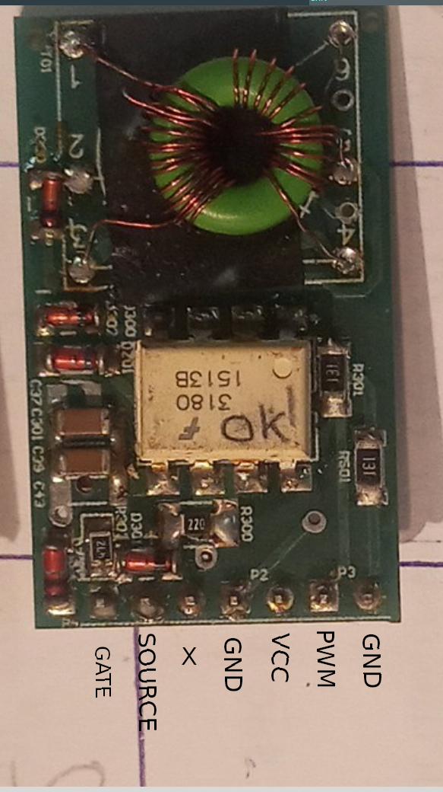
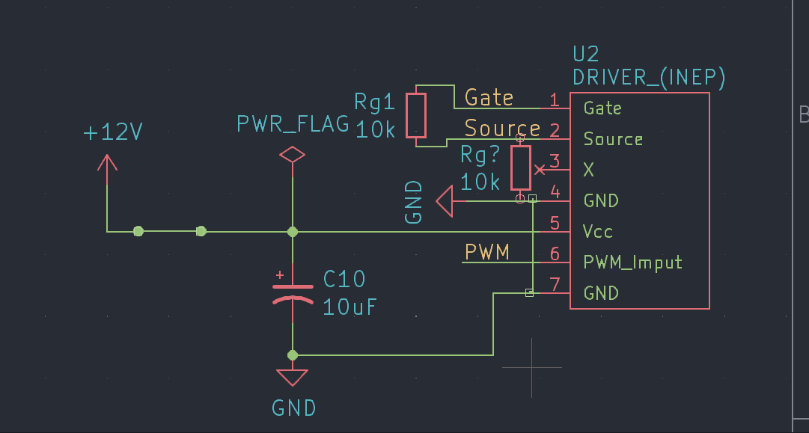
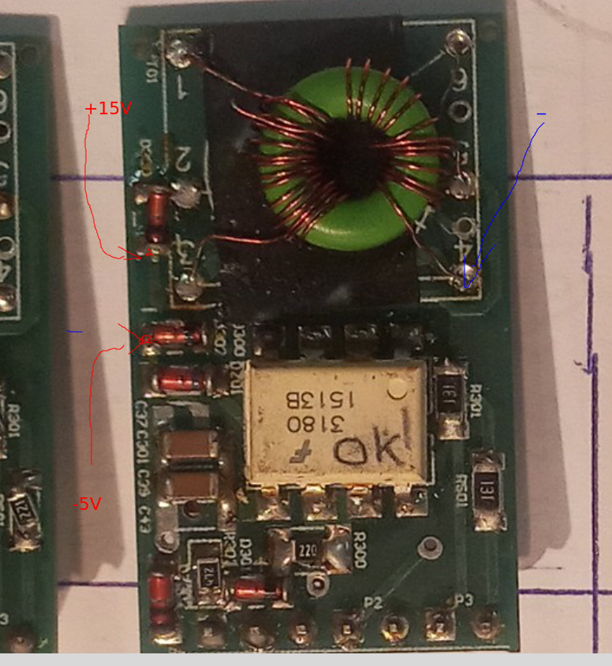

# MCC18
Solar panel MPPT, cuk converter, with microcontroller 

# Procedimento de testes - MCC18

 - [Inspeção](#inspeção)
 - [Disgnostico Inicial](#diagnóstico-inicial)
 - [Teste Geral](#teste-geral)
    - [Entrada e saida de potencia](#entrada-e-saída-da-potência)
    - [Funcional](#funcional)
 - [Testes Individuais](#testes-individuais)
    - [Signals](#signals)
    - [MCC CAN Shield](#mcccanshield) 
 - [Driver](#driver)
    - [Esquematico](#esquemático)
    - [Reparos Obrigatorios](#reparos-obrigatórios)
    - [Verificando funcionamento](#verificando-se-está-funcionando)
    - [Correção de falhas](#correção-de-falhas)
        - [Se não houver sinal retangular na saida](#se-não-houver-sinal-retangular-na-saida)
        - [Se não houver +15V e -5V](#se-não-houver-15v-e--5v)
        - [Se não houver tensão em um dos barramentos de +15V ou -5V](#se-não-houver-tensão-em-um-dos-barramentos-de-15v-ou--5v)
        - [Se tem tensão no barramento, mas não tem sinal em gate e source](#se-tem-tensão-no-barramento-mas-não-tem-sinal-em-gate-e-source)

**Importante**: 

NÃO TROCAR COMPONENTES ENTRE AS PLACAS, CADA MCC TEM SEU MCC_CAN_SHIELD, E CADA MCC_CAN_SHIELD TEM  SEU ATMEGA! 
SOMENTE REGRAVAR FIRMWARE EM ÚLTIMO CASO!
SEMPRE USAR LIMITE DE CORRENTE NAS FONTES!
SEMPRE LIMPAR EM BAIXO DO PLÁSTICO DOS CONECTORES BARRA_PINO!

Também Importante: Esse documento está escrito em ordem sequencial de testes, deve ser lido atentamente, pois um procedimento errado poderá causar danos permanentementes ao sistema, e as vezes difíceis de serem compreendidos.

## INSPEÇÃO
Antes de mais nada, limpeza com álcool e escova, mas especialmente em baixo das barras de pino, pois costumam acumular sujeira em baixo, entre o plástico preto e o cobre, eles podem ser levantados/retirados com uma pinça, fazendo uma alavanca, ou com um alicate universal.
Inspeção visual na placa inteira, especialmente por resíduos e manchas, que podem dar dica sobre onde pode existir problemas. Outro ponto de se observar são trilhas rompidas, componentes rachados ou com aspecto estranho.

## DIAGNÓSTICO INICIAL
Desconectar MCC_CAN_SHIELD, SIGNALS e DRIVER, bem como qualquer elemento externo a placa, como fontes de tensão.

Multímetro: entre B+ e P-, resistência dos indutores, na faixa de mOhms, se tiver alta impedância:
 - Um dos indutores em aberto
 - Shunt em aberto

Multímetro: entre P+ e P-, observar a carga do capacitor, um curto pode ser:
 - Capacitor do painel em curto
 - Mosfet em curto drain-source
 - Capacitor de acoplamento e diodo em curto
 - Capacitor de acoplamento e capacitor da bateria em curto

Multímetro: entre B+ e B-, observar a carga do capacitor, um curto pode ser:
 - Capacitor da bateria em curto
 - Diodo em curto
 - Capacitor de acoplamento em curto
 - Capacitor de acoplamento e capacitor do painel em curto

Multímetro: entre P+ e B-, observar a carga do capacitor de acoplamento, um curto pode ser:
 - Capacitor de acoplamento em curto
 - Diodo e Mosfet em curto

Multímetro: verificar se gate-source ou gate-drain não estão em curto.

## TESTE GERAL
Primeiro teste a ser realizado após limpeza e inspeção visual. Esse teste garante que as chaves e capacitores de potência estejam sem fuga de corrente para os níveis de tensão de trabalho nominal. Caso haja fuga de corrente, pode-se optar por aumentar o nível da corrente e localizar a fuga pela elevação de temperatura. 

 Importante: Obrigatório o uso de óculos de proteção.

### Entrada e Saída da potência

Nesta etapa testamos o isolamento da placa, a capacidade dos capacitores de suportar a tensão, bem como dos indutores, trilhas, fusível e shunt de suportar a corrente.

 - Desenconectar o MCC_CAN_SHIELD, DRIVER e SIGNALS
 - Fazer uma rampa de tensão de 0 a 50V @ 100mA entre B+ e B-
 - Fazer uma rampa de tensão de 0 a 30V @ 100mA entre P+ e P-
 - Fazer uma rampa de tensão de 0 a 100V @ 100mA entre P+ e B-
 - Fazer uma rampa de corrente de 0 a 10A @ 1V entre B+ e P-

### Funcional
**Alimentação e CIs possivelmente vivos**

 - Remover o atmega do MCC_CAN_SHIELD
 - Conectar o MCC_CAN_SHIELD, ligar o cabo CAN, verificar baixo consumo
 - Medir tensão de 5V

**Geração de PWM e sinal de vida**

 - Conectar o atmega no MCC_CAN_SHIELD
 - Conectar o conector da rede CAN, verificar baixo consumo de corrente
 - Conectar USB/SERIAL para monitorar a serial, deve observar ‘Início com sucesso’
 - Deve haver o surgimento de sinal pwm no pino do conector onde o driver fica encaixado, assim como o aumento da variável de duty cycle pela serial. Talvez a verificação dos limites mínimos para funcionamento esteja ativa, nesse caso, precisa adicionar fontes na entrada e saída.
 - Remover fontes externas, conectar driver, verificar baixo consumo
 -  SEM ATERRAMENTO , Medir Vgs, deve haver o mesmo sinal de pwm, de -5 a 15V @ 100kHz.

**Leitura de sinais de tensão**
 - Remover alimentação, conectar SIGNALS, MCC_CAN_SHIELD (com atmega)
 - Remover o DRIVER
 - Conectar USB/SERIAL para monitorar a serial
 - Fazer uma rampa de tensão de 0 a 30V @ 100mA entre P+ e P-:
    - Observar mudança na variável Vp
 - Zerar fonte de tensão:
    - Observar mudança na variável Vp
 - Fazer uma rampa de tensão de 0 a 50V @ 100mA entre B+ e B-:
    - Observar mudança na variável Vb
 - Zerar fonte de tensão:
    - Observar mudança na variável Vb

**MPPT e leitura de sinal de corrente**
 - Remover alimentação, conectar SIGNALS, MCC_CAN_SHIELD (com atmega), e DRIVER
 - Conectar USB/SERIAL para monitorar a serial
 - Resistência de carga no B+ e B-, pode ser na faixa de 100 Ohms
 - Fazer uma rampa de corrente de 1A @ 10V entre P+ e P-:
    -   CUIDADO:  tensão na saída não deve ultrapassar 50V, se a carga for desconectada, capacitores podem explodir e sensor de corrente queimar.
 - observar busca pelo ponto de máxima potência
 - observar mudança na variável Ip

**MPPT com potência**
 - Ainda sem dissipador e com o mesmo setup anterior, reduzir a resistência e aumentar a tensão e corrente na entrada até 5A na entrada
 - Montar dissipador, e com o mesmo setup, chegar até 8A na entrada.

### TESTES INDIVIDUAIS
A SER REALIZADO CASO FALHE EM ALGUM TESTE GERAL.

#### SIGNALS

 - Alimentação:
    - Alimentar placa com 5V pela barra de pinos
    - Injetar sinal de tensão em cada pino de entrada de sinal da placa e verificar se a tensão nos pinos de saída.
 - Sensores:
    - Remover Atmega
    - Alimentar a placa com o conector do CAN
    - Botar sinal em cada pino do conector de ADC da placa e verificar se a tensão no MCU está correta

#### MCC_CAN_SHIELD

 - Alimentação:
    - Remover atmega
    - Alimentar a placa com o conector do CAN
    - Verificar baixo consumo de corrente
    - Verificar tensão de 5V
 - Sensores:
    - Remover Atmega
    - Alimentar a placa com o conector do CAN
    - Injetar sinal de tensão em cada pino do conector de ADC da placa e verificar se a tensão no MCU está correta
 - Atmega328:
    - Verificar pinos de alimentação do atmega (todos abaixo de 5V
    - Colocar atmega
    - Alimentar a placa com o conector do CAN
    - Verificar clock e reset do atmega
 - CAN:
    - Colocar atmega
    - Alimentar a placa com o conector do CAN
    - Verificar clock do MCP2515
    - Verificar clock na SPI
    - Verificar RX (entre MCP2515 e MCP2551), deve ter alguma coisa
    - Verificar TX (não deve ter sinal)
    - Verificar CAN_H e CAN_L, devem ter sinal se tiver sinal no RX ou TX
 - Funcionamento:
    - Colocar Atmega
    - Alimentar a placa com o conector do CAN
    - Verificar baixo consumo de corrente
    - Conectar na serial e ler as mensagens

### DRIVER

Procedimento de Reparo do Driver Isolado INEP
IMPORTANTE
 Para testar o driver é muito importante que todos os equipamentos estejam isolados com transformador isolador, já que ao ser um driver isolado qualquer tensão aplicada pela rede pode acabar queimando os componentes do mesmo.
Para reduzir riscos de ESD é importante colocar um resistor de alto valor entre o gnd e o source do Mosfet.

### ESQUEMÁTICO:

https://drive.google.com/drive/u/0/folders/0B_EOV_z-bdXUR3FXRHJyZm9FUkE?resourcekey=0-0dKXDxxFrtL1GblLArqhaQ

**Pinagem:**

Muito cuidado que este driver pode ser soldado nos dois sentidos sempre verificar onde está a bobina

### Esquemático teste:

#### Reparos obrigatórios:
 
 - Trocar R80 para um resistor de 72 ohms
 - Trocar C28 por um capacitor de 1nF
 - Trocar RS01 e R301 por resistores de 220R
    

#### Verificando se está funcionando:

 - Antes de tudo fazer inspeção visual se todos os componentes estão nos seus devidos lugares 
 - Conectar o driver em uma protoboard e NÃO ESQUECER DE USAR TODOS OS EQUIPAMENTOS ISOLADOS E TER MUITO CUIDADO COM AS REFERENCIAS.
 - Conectar os dois resistores do esquemático e Colocar uma fonte limitada a 0.1A de 12V entre +12V e gnd (esquemático) e verificar o consumo de corrente, se está próximo aos (tem que medir) pode prosseguir com o teste se não ir para a etapa de correção de falhas.

 - Colocar um gerador de funções com 2.5V de amplitude e 2.5V de offset em 100khz e sinal retangular entre PWM e GND (não esquecer de conectar os dois GNDs) (é normal aumentar levemente o consumo)  e com um osciloscópio verificar se tem um sinal retangular entre gate e source de 100khz e Vmax de +15 e Vmin de  -5V. Se sim o driver pode ser testado em um controlador de carga. Se não vai ter que ir para a etapa de correção de falhas. 

#### Correção de falhas:
- Comportamentos:
#### Se não houver sinal retangular na saida
 - Verificar se tem +15V com a ponteira comum do multímetro no pino 4 do indutor e a vermelha no catodo do D300(localizado na proxima imagem)
 - Verificar se tem -5V com a ponteira comum do multímetro no pino 4 do indutor e a vermelha no anodo do D302(localizado na próxima imagem)
    

##### Se não houver +15V e -5V:
- Desconectar R80
 aplicar 12V em +12V e em GND (esquemático), colocar o osciloscopio com a referencia em GND e a ponteira no retângulo rosa da próxima imagem(pino 3 do 555 ou em R80) deveria ter uma sinal retangular de 250khz) se não houver o problema está no circuito do 555

 - Se houver sinal retangular o circuito do 555 está correto
 - Medir com o multímetro em tensão de junção (diodo) com a ponteira preta no pino 7 ou 8 de Q1 e com a vermelha no pino 1 deveria ter aproximadamente 0.7V, se estiver em 0 ou em circuito aberto significa que o Q1 está queimado,

 - Medir com o multimetro em tensão de junção (diodo) com a ponteira preta no pino 3 de Q1 e com a vermelha no pino 5 ou 6 deveria ter aproximadamente 0.7V, se estiver em 0 ou em circuito aberto significa que o Q1 está queimado, 

 - logo passar para as verificações do caso de Se não houver tensão em um dos barramentos de +15V ou -5V
 - Se nenhum desses procedimentos solucionarem , trocar Q1 (não esquecer de conectar R80) e verificar se volta a ter tensão em +15 e -5 
 
##### Se não houver tensão em um dos barramentos de +15V ou -5V
 - Medir com o multímetro em tensão de junção (diodo) e verificar se D300 e D302 estão funcionando corretamente, se não trocar
 - Medir com o multímetro em escala de ohms, entre o barramento (+15V e -5V) e GND, se houver curto em um unico barramento provavelmente seja C300, C42, C36, C38 para +15V em curto, C301, C37, C39, C43 para -5V em curto. 
 - Medir em tensão de junção (diodo) entre -5V (vermelha) e +15V (preta) deveria estar próximo dos 0.7V se não estiver DZ01 está com falha.
 - Medir entre o pino 5 e 2 da bobina com o multímetro em ohms, deveria estar proximo dos 0ohms, se estiver em circuito aberto significa que a bobina está mal soldada ou com enrolamento cortado.

##### Se tem tensão no barramento, mas não tem sinal em gate e source
 - Medir com o multímetro em tensão de junção entre os pinos 2 e 3 do U300, deveria ter aproximadamente 1.2V se não tem provavelmente U300 está queimado.

 - Medir entre o pino 6 ou 7 do U300 e o source do driver, com o multímetro em ohms, deveria ter aproximadamente 4.7k, se não tiver provavelmente DZ301 ou DZ302 estão queimados, ou também R303 ou R302 ou R300.
 - Com uma fonte limitada a 0.03A, com 20V conectar o positivo em +15V (catodo D300) e o negativo em -5V (anodo do D302), colocar um gerador de funções com sinal retangular offset de 2.5V, amplitude de 2.5V e frequencia de 100khz entre pwm e GND e um resistor de 10k entre GND e -5V. Medir com osciloscópio com a referencia no GND da fonte e com a ponteira no pino 6 ou 7 do U300, deveria ter um sinal retangular de 0 a 20V, se não houver ou se a fonte limitar provavelmente U300 está queimado, se houver testar trocando Q1 e ver se o driver funciona, se não provavelmente o driver está possuído, melhor ir para o proximo

        

